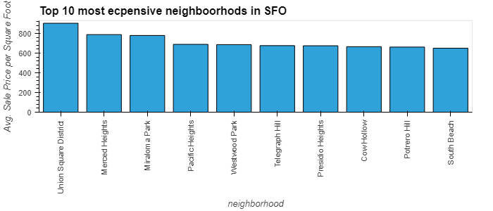

# ***San Fransico Rental Analysis 2010-2016***
## **Average Sale Price Per Sqaure Foot and Gross Rent in San Francisco**
### The welcome tab of the San Francisco Dashboard intruduces you to a map of San Francisco where each cirlce is an area in San Francisco  including the average sale price per sqaure foot depicted by the size of each cirlce and gross rent depicted by the color of each cirlce. This interactive map allows you to zoom into areas in San Francisco that interest you and see the average sale price per sqaure foot and gross rent.
----

## **Housing Units Per Year**
### The Yearly Market analysis tab starts off with a bar plot depicting the number of housings units per year in San Francisco from 2010 to 2016. The Hvplot extension allows you to zoom in and out of the graph as the users pleases to focus more on specific years or limit your y axis to a certain number of units. 
---

## **Average Gross Rent in San Francisco Per Year**
### The Yearly Market analysis tab also includes a line plot that depicts the average gross rent by year in San Fransico from 2010 to 2016 so that we can better understand housing costs over this period. The hvplot extension allows the user to zoom in to the specific data that is wanted. 
----

## **Average Price Per Square Foot  in San Francisco Per Year**
### The last visualization in the Yearly Market analysis tab is a line plot depicting the average price per square foot in San Francisco from 2010 to 2016. This gives the user an idea of the average price per sqaure foot over a 6 year period. Using the hvplot extension the user is able to zoom into the data that is most relavant. 
----

## **Average Prices By Neighborhood(per Sqaure Foot)**
### The neighborhood analysis tab starts off with  average prices by neighborhood per Sqaure Foot from 2010-2016. This visualization allows the user to choose the specific neighborhood they are looking for and see the average prices over a 6 year period for that neighborhood. This is graphed using Hvplot which also allows the user to zoom into specifc portions of the data using the options and the right hand side of the graph.
----

## **Average Prices By Neighborhood(Gross Rent)**
### The neighborhood analysis tab shows the user the average gross montly rent by neighborhood from 2010-2016. This visualization allows the user to choose the specific neighborhood they are looking for and see the average prices over a 6 year period for that neighborhood. This is graphed using Hvplot which also allows the user to zoom into specifc portions of the data using the options and the right hand side of the graph.
----

## **Comparing Cost to Purchase Versus Rental Income**
### The third visualization in the neighborhood analysis tab gives the user a side-by-side comparison of average price per square foot versus average monthly rent by year on the same line graph. Using the drop down users are able to change neighborhoods and see a comparison for that specific neighborhood. The user is also able to use Hvplot to zoom into specifc portions of the data using the options and the right hand side of the graph.
----

## **Top 10 Most Expensive Neighborhoods**
### The last visualization in the neighborhood analysis tab includes a bar graph of  the average sales price for the  top 10 most expensive neighborhoods in San Francisco from 2010-2016. Hvplot also allows the users to use its tool to pick specific parts of the graph
---

## **Parallel Categories  Plot**
### The interactive market analyis by Neighborhood tab inculdes a parallel catagories plot that includes the top 10 most expensive neighborhoods their sales price per square foot, number of housing units, gross rent. The color of each line in the plot also gives the user an idea of the sales price per square foot. Plotly allows the user to move around each catagory to their liking so that they can see which neighborhood suits them the best based on this analysis.
---

## **Parallel Coordinates Plot**
### The second plot in the interactive market analyis by Neighborhood tab includes a parallel coordinates plot that compares sales price per square foot, number of housing units, gross rent. The color of each line alos represents sales price per sqare foot. Using the built in tools provided by Plotly the user can change around each catagory to best suit their needs.
----
 

